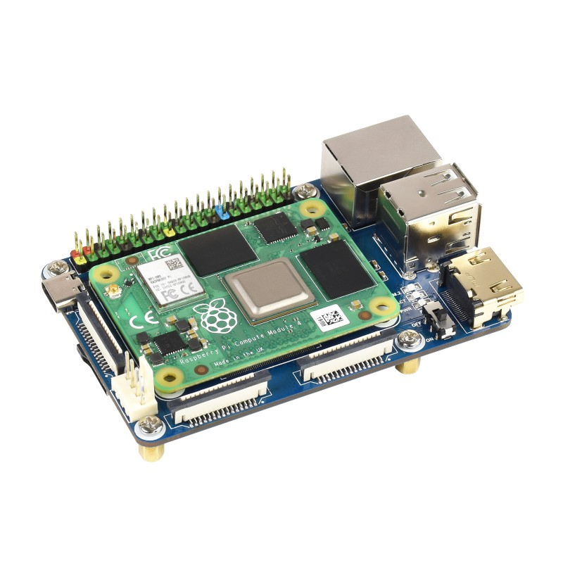

# Waveshare CM4-IO-Base-B

- [Waveshare wiki](https://www.waveshare.com/wiki/CM4-IO-BASE-B)
- [Booting CM4 from NVME](https://blog.j2i.net/2022/04/12/booting-a-pi-cm4-on-nvme/)

## Loading Image on CM4

Follow Jeff Geerling's [video](https://www.youtube.com/watch?v=jp_mF1RknU4) on how to do this.

Jeff also explains how the antenna works, you don't need to
plug in the external [ref](https://www.jeffgeerling.com/blog/2022/enable-external-antenna-connector-on-raspberry-pi-compute-module-4)

1. macOS
    - brew install libusb
    - brew install pkg-config
1. Download rpiboot: https://github.com/raspberrypi/usbboot
    - make
    - ./rpiboot
1. Set Boot selection switch to `on`
1. Don't plug anything in, just the CM4 module
1. Plug in the USB-C cable and the pi will mount as a USB drive
1. Run RPi Imager, use PiOS Lite, 64-bit

