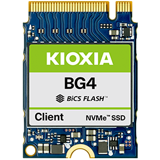
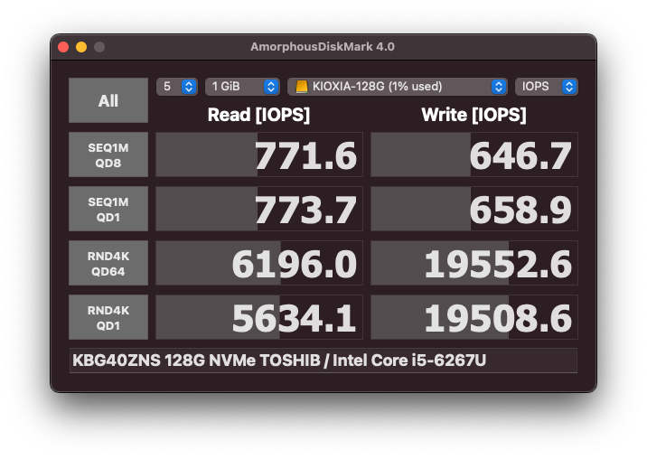

# KIOXIA KBG40ZNS 128GB

The BG4 series is a line-up of compact single package NVMe™ SSDs with capacities up to 1,024GB, and leverages a PCIe® Gen3 x4 interface and KIOXIA 96-layer TLC BiCS FLASH™. With higher bandwidth and improved flash management and Host Memory Buffer (HMB) technology, BG4 SSDs deliver best-in-class read performance in single package SSDs, of up to 2,300MB/s (sequential read) and up to 390K IOPS (random read), with active power consumption of up to 3.7W (Typ.).

The BG4 series is available in four capacities of 128GB, 256GB, 512GB and 1,024GB in surface-mount M.2 1620 single package or removable M.2 2230 module form factor options, making them suitable for thin and light system designs for ultra-thin PCs, as well as embedded devices and server boot in data centers. The BG4 series is with the option of a Self-Encrypting Drive (SED) model supporting TCG Opal Version 2.01.

- [Product website](https://americas.kioxia.com/en-us/business/ssd/client-ssd/bg4.html)
- [Datasheet](BG4.pdf)

